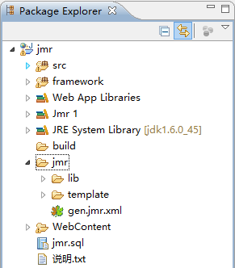
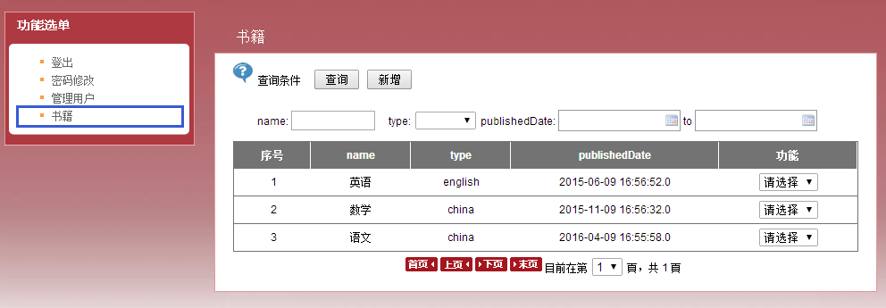
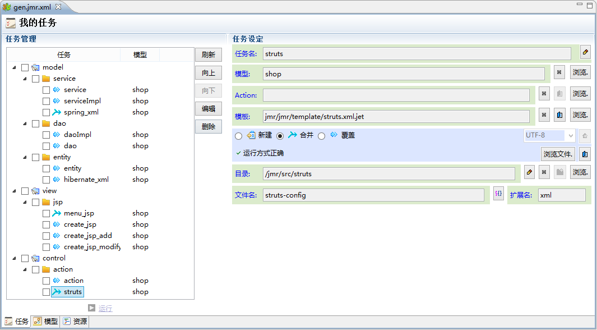

# 
实战演示
 #

----------
接下来，通过一个项目来演示，jmr应用在实战中的效果。

### 实战项目 ###

以下是一个典型的java web项目。

项目布局本身不复杂，左边是项目的功能菜单，右边是实际的功能实现。
其中，书籍这个模块是jmr生成的，包括增删查改在内的所有代码。

查询页面

新增页面

修改页面

项目的结构是传统的MVC模式，jmr生成了从实体类到jsp页面的所有代码。以下就是所有生成任务。

我们在后面的教程中，会结合这个项目给大家介绍如何利用jmr为自己的项目定制代码生成。

