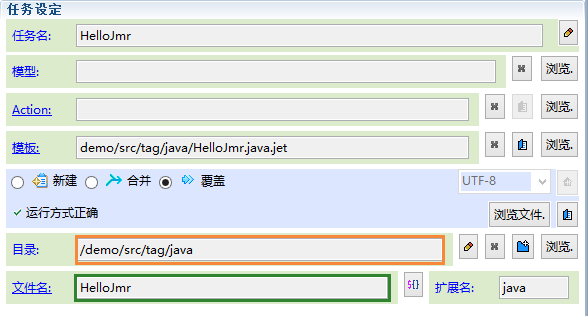
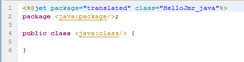

# 
java标签
 #

----------

###介绍###

<pre>
在编写java模板时，我们可以通过一系列以java开头的标签，自动获取java包名和类名的标签
</pre>

###java标签###

* <a href="tag-java-package.html"><java:package/></a>：包名，根据生成目录所在的java包，自动生成包名
<pre>
注：生成java类必须是在java源代码文件夹中，否则得不到包名。
</pre>
* <a href="tag-java-class.html"><java:class/></a>：类名，根据任务的生成文件名自动生成类名
<pre>
注：得到的值同&lt;t:name/&gt;，但它可以设置classNameVar和fullyClassNameVar等变量，
设置这些变量需要生成的java类在源代码文件夹中。
</pre>
###实例演示###

----------

<pre>
我们生成一个名为HelloJmr.java的文件，生成目录选在java源文件夹tag.java下。
</pre>

<pre>
在模板中写入package和class标签
</pre>

<pre>
注：
1.java源文件
2.package名称
3.文件名即类名
</pre>

