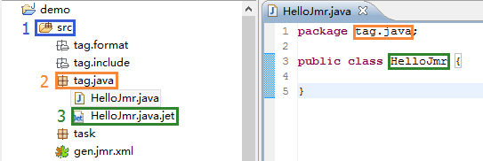

# 
java标签
 #

----------

###介绍###

<pre>
在模板中，我们可以通过一系列以java开头的标签，自动获取java包名和类名的标签。
</pre>

###java标签###

* <a href="tag-java-package.html"><java:package/></a>：包名
* <a href="tag-java-class.html"><java:class/></a>：类名

###实例演示###

----------

<pre>
我们生成一个名为HelloJmr.java的文件，生成目录选在java源文件夹ch2.s8下。
</pre>

<pre>
在模板中写入package和class标签
</pre>

<pre>
package标签根据生成目录所在的java包，自动生成包名，class根据任务的生成文件名自动生成类名。
注意，生成目录必须是在java源包中，否则得不到包名。
</pre>

