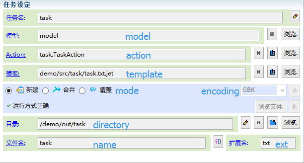
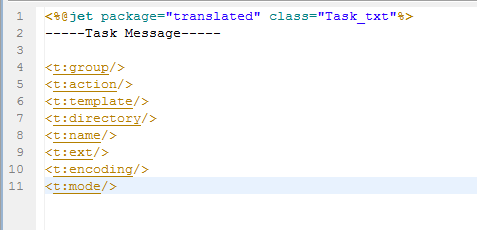

# 
Task Tag
 #

----------

###Introduce###

<pre>
We can use tags of namespace "t" to get the task information in the template.
</pre>

###Task Tag###

* <a href="tag-task-group.html"><t:group/></a>：Group
* <a href="tag-task-action.html"><t:action/></a>：Action
* <a href="tag-task-template.html"><t:template/></a>：Template path
* <a href="tag-task-directory.html"><t:directory/></a>：Generate file directory
* <a href="tag-task-name.html"><t:name/></a>：Generate file name
* <a href="tag-task-ext.html"><t:ext/></a>：Generate file extension
* <a href="tag-task-encoding.html"><t:encoding/></a>：Generate file encoding
* <a href="tag-task-mode.html"><t:mode/></a>：Generate file mode (new, merge, overlay)

###Examples###

----------

