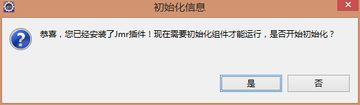
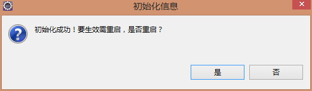
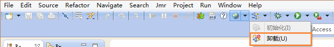
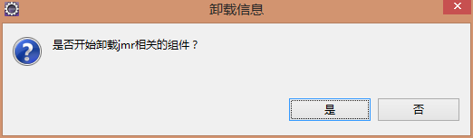
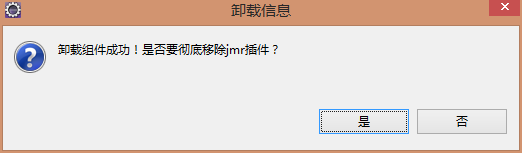
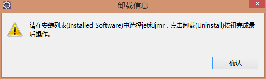

# 
Install and Uninstall
 #

##Install##

###Download Address###
<a>http://www.jmr-source.com/downloads/jmr_1.0.0/</a>

###Eclipse Version###
* Eclipse j2ee 3.5~4.5 can be installed and used immediately
* Other Eclipse versions 3.5~4.5 if there is no need to install the following plugins
 * Gef：Graphical editing framework for Eclipse
 * Emf：Eclipse model framework
 * WTP：Developing tools for J2EE Web applications

###How to install###
In the Eclipse menu bar, click Help -> Install New Software -> Add

 

Check Jet and Jmr, Click Next until the download is complete and restart Eclipse

 

After the restart will prompt to start the initial, click Yes, Start to initialize Jmr components

 

After the initialization of the component, restart Eclipse

 

Installation success, you can see the Jmr icons in the toolbar

 

##Uninstall##

Click the uninstall in the toolbar

 

Click Yes to start uninstall

To completely remove the Jmr plugins, please click Yes

Click Ok

 

Select the Jet and Jmr components, click Uninstall to complete the final uninstall, and then restart Eclipse to end uninstall

 
