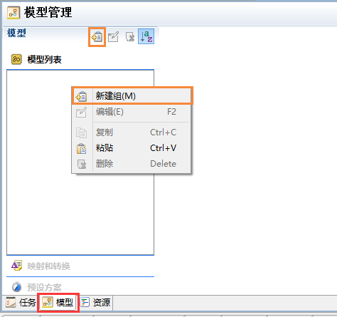
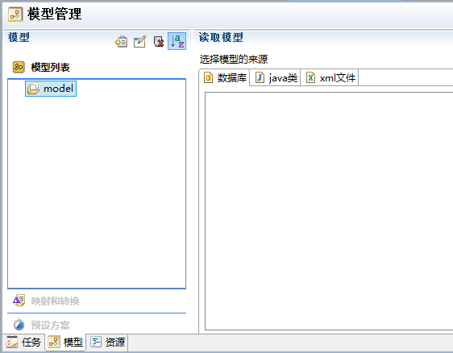
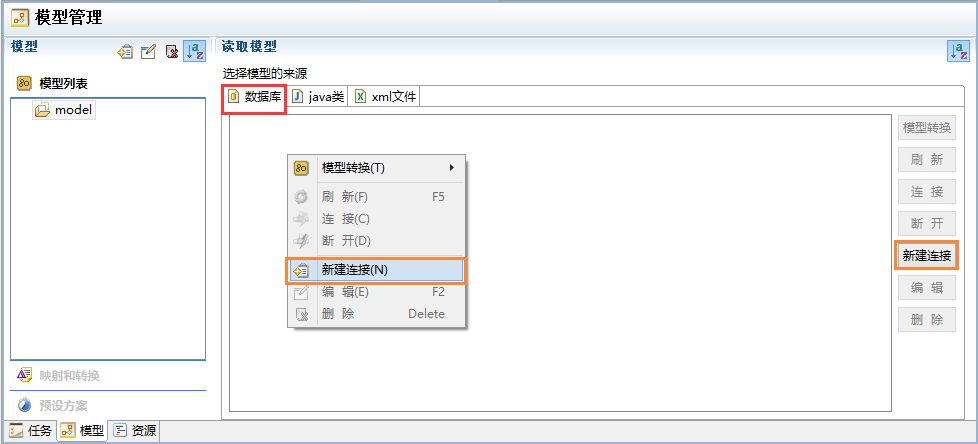
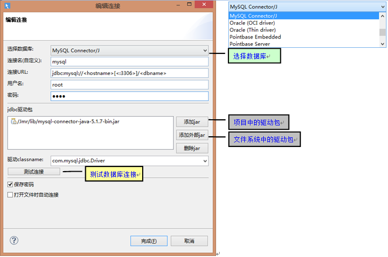
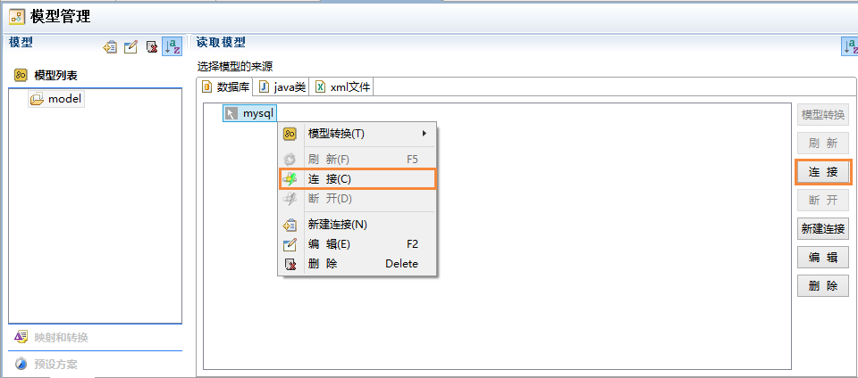
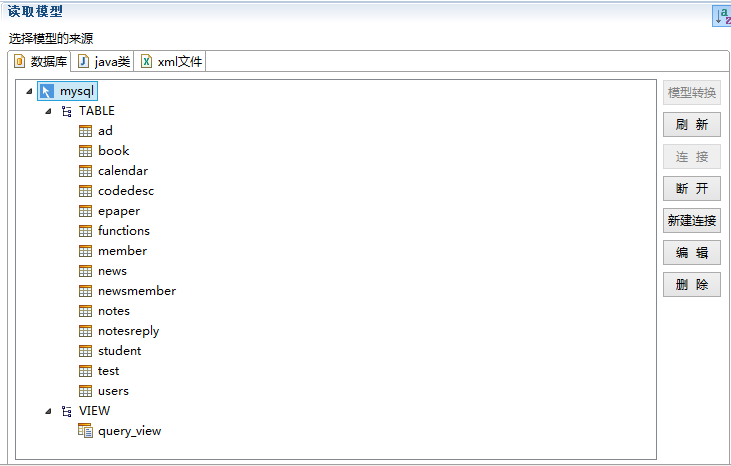
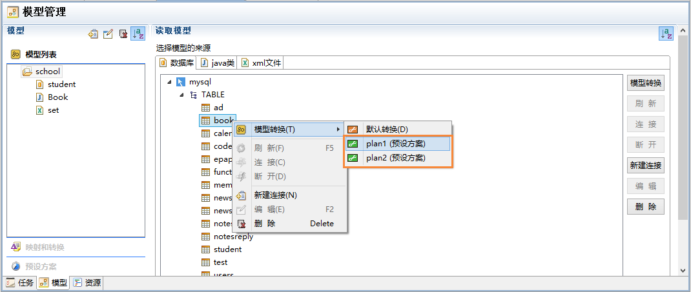

# 
模型结构  - 数据库
 #

----------

###目录:###

* [新建模型组](#1)
* [设置数据库连接](#2)
* [生成模型](#3)

----------

##前言##

Jmr可以通过读取数据库中的表和视图建立对应的模型。
<pre>
整个读取过程只需做2步：
1.配置数据库连接，并连接数据库。
2.读取表或者视图转换成模型。
</pre>

----------

##新建模型组##

首先，打开jmr文件,切换模型页,点击菜单上的新建按钮，或者在模型列表中右键，新建组。

输入组名，例如：model。

新建完成后，右边副页出现数据来源配置，目前支持从数据库、java类、xml文件生成模型。

PS：关于模型组：模型组是一组模型的集合，它可以包含从各种数据源获取的模型。

在任务配置中，可以设置模型组，模板可以获取模型组中的数据。

----------

##设置数据库连接##

在模型页中，小伙伴们可以记录数据库的信息，并通过它查询数据库中的表和视图，转化成模型。

选中任意的模型组，在从属页面中，选择“数据库”,右键菜单或者右侧菜单“新建连接”。

在数据库配置页面中，配置数据库连接信息。
<pre>
需要注意几点：
1.可选的数据库包含了大部分主流数据库，如果没有，请选择Other。
2.一般数据库厂家都会提供jdbc驱动包，正常只有一个，但sqlserver2000包含3个，请都加入。
3.导入的驱动包建议放在项目路径下。
4.根据jdbc的协议，classname可能有多个，加入完驱动包后，会自动列出classname，请选择合适的使用。
5.建议测试下数据库连接，如果有错误会提示，错误一般是配置信息错误，数据库未安装或者服务没启动。
</pre>

配置完毕后，右键菜单或者右侧菜单点击“连接”。

连接成功后，会显示表和视图的结构；如果数据库变动了，右键菜单或者右侧菜单点击“刷新”。

----------

##生成模型##

模型是jmr的核心资产，它代表了数据源的信息，我们把它传递给模板生成代码。
我们现在开始就要把表和视图的信息，转换成jmr可以理解和扩展的模型。

选中表或者视图，右键菜单-->模型转换-->默认转换。

生成了模型book，这个模型是表或者视图的结构信息。
默认转换生成的是基础模型，我们一般会在此基础上扩展模型。

选中表或者视图，右键菜单-->模型转换-->默认转换。

生成了模型book，这个模型是表或者视图的结构信息。
默认转换生成的是基础模型，我们一般会在此基础上扩展模型。

也可以通过预设方案来转换模型，预设方案可以预先设置好需要扩展的结构。
在转换时除了默认结构的转换，也会同时进行扩展结构的转换。

关于预设方案请阅读：  
<a href="model-structure-db-entity.html#11">预设方案</a>  
<a href="model-structure-db-entity.html#12">使用预设方案生成模型</a>

----------