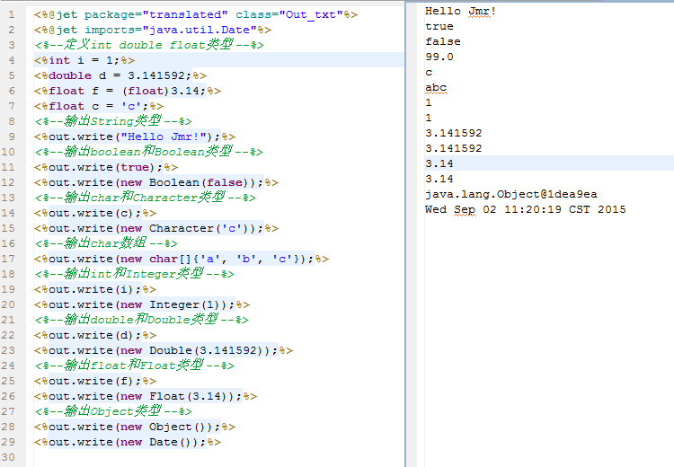

# 
out 内置打印对象
 #

----------

###目录:###

* [作用与用法](#1)

----------

##作用与用法##

out是一个模板的内置java对象，用来输出java脚本中的类型对象到模板中。  
格式：out.write(Object obj)。  
可以输出的java类型有 Object String boolean char char[] double float int long

其中int long char double float还可以输出其包装类Integer Charater Double Float  
Object类型将调用它的toString()方法输出，  
比如Date的toString()方法重写过，就不在是对象地址的格式xx.xx.xx@xxx的格式，如下。

----------
