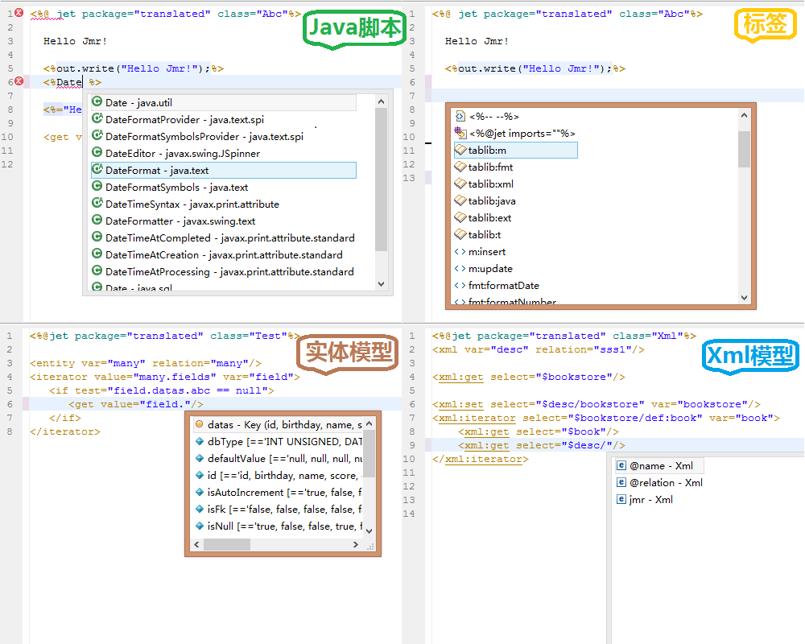
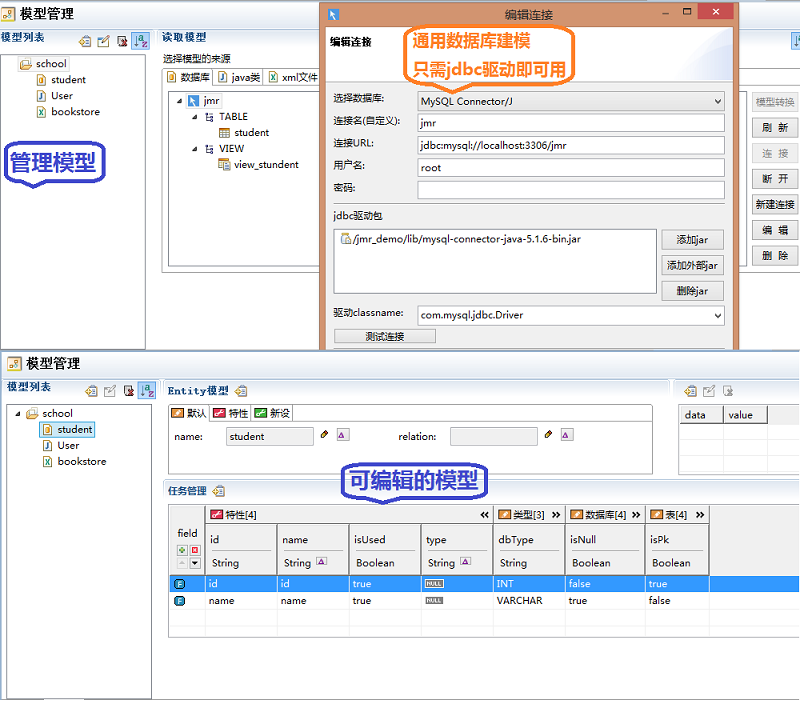
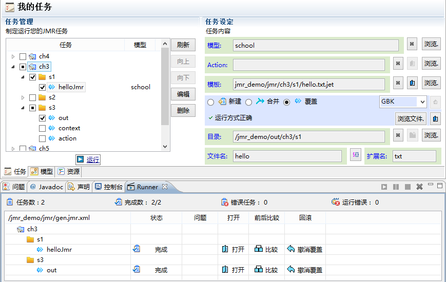

# 
前言
 #

##Jmr是什么##
Jmr是一款最前沿，基于Eclipse通用模型开发和代码生成的工具。

##对我有什么帮助##

##Jmr能给开者带来的体验##
Jmr作为一款开发工具，能给小伙伴们带来怎么样的体验呢？

####一. 易学的规范语法、易用的强大编辑器####
<pre>
基于jet模板语法，接近于jsp，聪明的亲们可以快速上手；
支持java脚本、表达式和标签。有丰富功能的标签库；   
能够写出清新优雅的模板，同时生成复杂的逻辑。
</pre>	

<pre>
编辑器方便小伙伴们开发，语法高亮，代码提示，错误检查等一应俱全；
并且集成了Eclipse上的操作习惯，智能程度不亚于现有的jsp编辑器；
我们在编辑器功能细节上下了很多功夫，让亲们可以轻轻松松地写模板。	
</pre>
  

####二. 通用的建模工具、丰富的模型来源####
<pre>
我们先来研究下模型驱动开发和代码生成：
</pre>
  

<pre>
模型，本质上是一组数据“拼块”，用来填入模板这个“拼图”。
它的来源有很多，Jmr现在提供了几种来源：
 1.数据库的表和视图的结构模型。
 2.Java实体类的结构模型。
 3.Xml文件的结构模型。
 4.自定义参数模型，通过建立Action类来自定义模型参数。
</pre>
        

      
####三. 完善的任务管理、时时把握生成进度####

##关于工具的定位##

Jmr作为建模和代码生成的定位可以用3个词汇概括：“通用”，“灵活”，“易用”。
    
###通用：###
  
<pre>
1)项目通用性：只要在Eclipse中新建的项目，不管是什么类型的，
  都可以无缝集成Jmr。
    
2)框架通用性：无需特定框架，由于模板的通用性，小伙伴们可以自己开发出
  适应自己框架的模板，可以很好的和框架结合和互补。
    
3)生成内容通用性：可以生成任何格式的文本文件，只要是有规则又经常需要
  重复的代码、文档或者其他格式的文本，都可以通过jmr来生成。
</pre>

###灵活：###

<pre>
1)建模的灵活：提供数据库表、视图，java实体类转化成实体结构，可以在转化
  的模型上自定义扩展模型结构。并且提供Xml的建模。
  用户还可以自己定义java的Action类，在Action类中可以自定义参数模型。

2)模板的灵活：模板文件类似于jsp，提供各种表达式和标签库，可以像写jsp那样
  展现出丰富多彩的结构和各种复杂逻辑的生成。可以说超越绝大部分的模板引擎。

3)生成任务的灵活：小伙伴们可以自定义生成任务；
  可以在任务中指定模型、模板、生成目录，生成文件等；
  可以制定生成、合并、覆盖3种模式的生成任务；
  可以跟踪生成中的错误、还可以比较生成前后的不同，并且做回退操作。
</pre>

###易用：###
<pre>
1)易上手：模板语言易学，功能人性化，学习成本极低。

2)完善的文档：文档图文并茂，内容精简，用例多，花上半天时间就能入手开发。

3)社区力量：开放QQ群，论坛等，小伙伴么有什么问题或意见  
  可以直接和我们工具开发人员沟通，我们将在大家的意见上开发后续版本。
</pre>