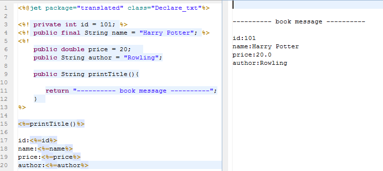
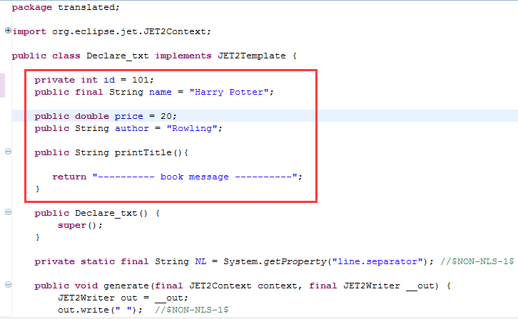

# 
<%! %> - 声明
 #

----------

###目录:###

* [格式与用法](#1)
* [原理](#2)

----------

##格式与用法##

格式：<%! %> ，在此可以声明模板的变量和函数，相当于类成员。

----------

##原理##

查看这个模板的编译类后，可以看到，<%! %>块的内容转换成java类成员。

----------

