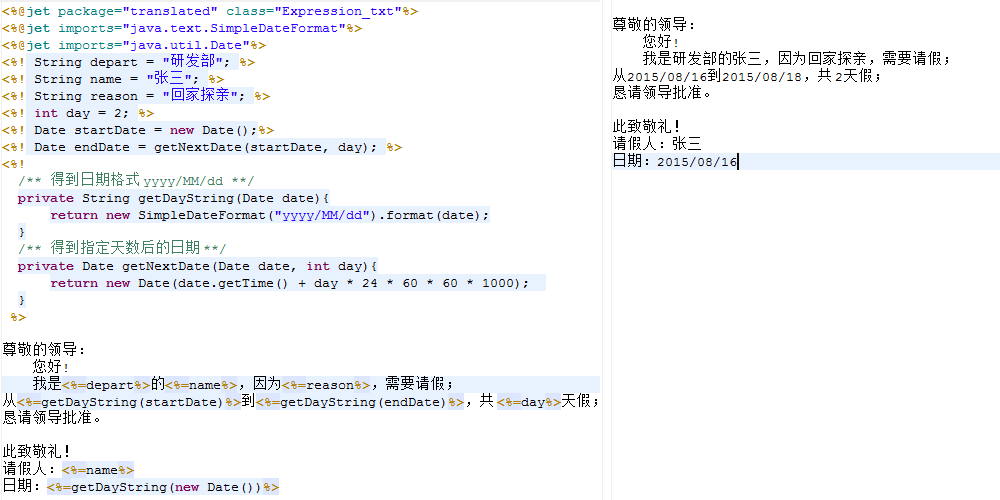
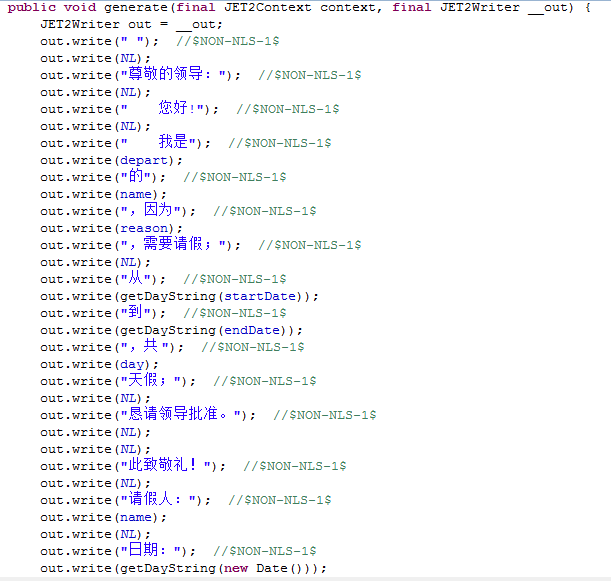

# 
<%= %> - 表达式
 #

----------

###目录:###

* [格式与用法](#1)
* [原理](#2)

----------

##格式与用法##

格式：<%= %> ，输出值，这个值可以是个变量，字符串，数值，返回函数等，  
可以看成<% out.write() %>，关于out内置对象(<a href="out.html">详细请点击</a>)。

----------

##原理##

查看这个模板的编译类后，可以看到，<%=%>块的内容编译到方法generate()中成为<% out.write() %>。

----------