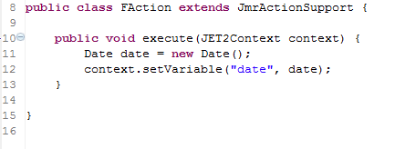

# 
f:date - 格式化时间
 #

&lt;f:date&gt;
<pre>
格式化时间。
</pre>

#### 说明 ####

<pre>
根据标签内填写的时间字符串，输出格式化的时间,或者设置格式化的时间参数
</pre>

#### 属性 ####

<pre>
<b>var（可选）：存储格式化日期的变量。</b>
如果设置了var属性，只是设置了存储的变量，不会输出结果。
</pre>

<pre>
<b>setScope（可选）：设置变量的作用域。</b>
context:设置参数到context中(默认)
session:设置参数到session中
</pre>

<pre>
<b>pattern（可选）：格式化的样式。</b>
如：yyyy-MM-dd、yyyy-MM-dd HH:mm:ss。
具体用法参考java.text.DateFormat
</pre>

<pre>
<b>type（可选）：类型</b>
date:日期
time:时间
both:日期和时间
</pre>

<pre>
<b>dateStyle（可选）：日期样式。</b>
default:默认样式，同MEDIUM. 2004-5-31
medium: 2004-5-31
short: 04-5-31
long: 2004年5月31日
</pre>

<pre>
<b>timeStyle（可选）：时间样式。</b>
default:默认样式，同MEDIUM. 23:59:59
medium: 23:59:59
short: 下午11:59
long: 下午11时59分59秒
</pre>

<pre>
<b>timeZone（可选）：设定使用的时区,默认当前时区。</b>
所有时区id，请参考java.util.TimeZone.getAvailableIDs()
如：
中国上海的时区 ID 是 Asia/Shanghai
美国太平洋时区 ID 是 America/Los_Angeles
</pre>
#### 其它 ####

<pre>
如果设置了var属性，只是设置了存储的参数，不会输出结果。
</pre>

----------

#### 实例演示 ####

<pre>
例子1
</pre>

在action中设置date参数.

