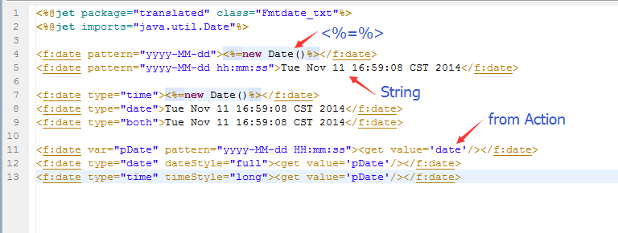
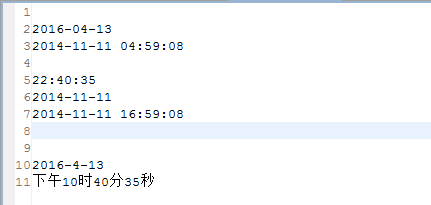

# 
f:date - Formatting Date
 #

&lt;f:date&gt;
<pre>
Formatting date
</pre>

#### Description ####

<pre>
According to the time to fill in the tag string, 
the output of the time, or set the time format parameters
</pre>

#### Property ####

<pre>
<b>var（optional）</b>
Set the variable to format the date
Note: if the var property is set, the result will not be output
</pre>

<pre>
<b>setScope（optional）</b>
Set the scope of the variable

<b>property</b>
context:Set variable to context(default)
session:Set variable to session
</pre>

<pre>
<b>pattern（optional）</b>
Format pattern
e.g.：yyyy-MM-dd、yyyy-MM-dd HH:mm:ss
Specific usage reference java.text.DateFormat
</pre>

<pre>
<b>type（optional）</b>
Date type

<b>property</b>
date:date type(default)
time:time type
both:date and time type
</pre>

<pre>
<b>locale（optional）</b>
Set the language of date, default is the local language(e.g. English is en, Chinese is zh)
</pre>

<pre>
<b>timeZone（optional）</b>
Set the timeZone of date, default is the local timeZone
e.g.：
Shanghai,China is Asia/Shanghai
Los Angeles,America is America/Los_Angeles
All time zones ID, please refer to java.util.TimeZone.getAvailableIDs()
</pre>

<pre>
<b>dateStyle（optional）</b>
Date style

<b>property</b>
default:default style is medium. 2004-5-31
medium:2004-5-31
short:04-5-31
long:May 31, 2004
full:Monday, May 31, 2004
</pre>

<pre>
<b>timeStyle（optional）：Time style.</b>
default:default style is medium. 11:59:59 PM
medium: 23:59:59
short: 11:59:59 PM CST
long: 11:59:59 PM CST
</pre>

#### Other ####

<pre>
If the var is set, the result will not be output
</pre>

----------

#### Examples ####

<pre>
Example 1
</pre>

