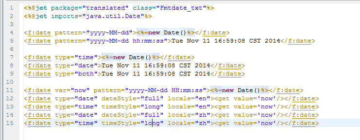
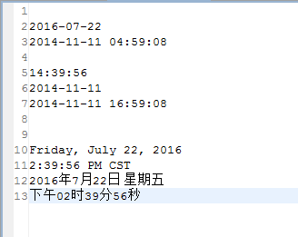

# 
f:date - 格式化时间
 #

&lt;f:date&gt;
<pre>
格式化时间
</pre>

#### 说明 ####

<pre>
根据标签内填写的时间字符串，输出格式化的时间，或者设置格式化的时间参数。
</pre>

#### 属性 ####

<pre>
<b>var（可选）</b>
存储格式化日期的变量
注：如果设置了var属性，不会输出结果
</pre>

<pre>
<b>setScope（可选）</b>
设置变量的作用域

<b>属性</b>
context:设置变量到context中（默认）
session:设置变量到session中
</pre>

<pre>
<b>pattern（可选）</b>
格式化的样式
如：yyyy-MM-dd、yyyy-MM-dd HH:mm:ss
具体用法参考java.text.DateFormat
</pre>

<pre>
<b>type（可选）</b>
类型

<b>属性</b>
date:日期（默认）
time:时间
both:日期和时间
</pre>

<pre>
<b>locale（可选）</b>
区域语言，默认为当前区域的语言（如中文zh，英文en等）
</pre>

<pre>
<b>timeZone（可选）</b>
区域时区，默认当前区域的时区
如：
中国上海的时区是 Asia/Shanghai
美国洛杉矶时区是 America/Los_Angeles
所有时区id，请参考java.util.TimeZone.getAvailableIDs()
</pre>

<pre>
<b>dateStyle（可选）</b>
日期样式

<b>属性</b>
default:默认样式，同MEDIUM 2004-5-31
medium:2004-5-31
short:04-5-31
long:2004年5月31日
full:2004年5月31日 星期一
</pre>

<pre>
<b>timeStyle（可选）：时间样式。</b>
default:默认样式，同MEDIUM. 23:59:59
medium: 23:59:59
short: 下午11:59
long: 下午11时59分59秒
</pre>

#### 其它 ####

<pre>
如果设置了var属性，不会输出结果
</pre>

----------

#### 实例演示 ####

<pre>
例子1
</pre>

