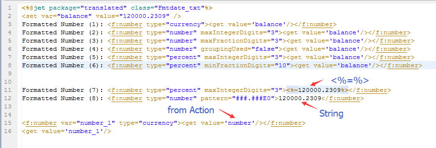
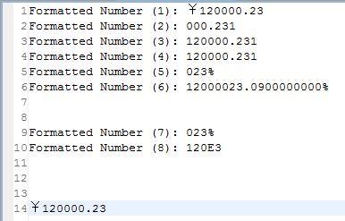

# 
f:number - Formatting Number
 #

&lt;f:number&gt;
<pre>
Formatting number
</pre>

#### Description ####

<pre>
According to the content of tag, output format of the number, or set the variable.
</pre>

#### Property ####

<pre>
<b>var（optional）</b>
Set the variable to format the number
Note: if the var property is set, the result will not be output
</pre>

<pre>
<b>setScope（optional）</b>
Set the scope of the variable

<b>property</b>
ontext:Set variable to context(default)
session:Set variable to session
</pre>

<pre>
<b>pattern（optional）</b>
Format pattern

e.g.: 12.34
"0.0"      ->   12.3      
"#.#"      ->   12.3
"000.000"  ->   012.340
"###.###"  ->   12.34 
reference java.text.DecimalFormat
</pre>

<pre>
<b>type（optional）</b>
Number type

<b>property</b>
number:number type(default)
currency:currency type
percent:percent type
</pre>

<pre>
<b>groupingUsed（optional）</b>
Whether to group number

<b>property</b>
true:yes
false:no(default)
</pre>

<pre>
<b>currencyCode（optional）</b>
ISO 4217 currency code, default is the local currency code, 
when type= "currency" is available
e.g.：
China Yuan renminbi is CNY
US dollar is USD
</pre>

<pre>
<b>currencySymbol（optional）</b>
currency symbol, default is the local currency symbol, 
when type= "currency" is available
e.g.：
China Yuan renminbi is ￥
US dollar is $
</pre>

<pre>
<b>locale（optional）</b>
Country, default is the local country
e.g.：
China is zh_CN
America is en_US
</pre>

<pre>
<b>integerOnly（optional）</b>
Sets whether or not numbers should be parsed as integers only

<b>property</b>
true:yes
false:no(default)
</pre>

<pre>
<b>maxIntegerDigits（optional）</b>
Sets the maximum number of digits allowed in the integer portion of a number
</pre>

<pre>
<b>minIntegerDigits（optional）</b>
Sets the minimum number of digits allowed in the integer portion of a number
</pre>

<pre>
<b>maxFractionDigits（optional）</b>
Sets the maximum number of digits allowed in the fraction portion of a number
</pre>

<pre>
<b>minFractionDigits（optional）</b>
Sets the minimum number of digits allowed in the fraction portion of a number
</pre>

#### Other ####

<pre>
If the var is set, the result will not be output
</pre>

----------

#### Examples ####

<pre>
Example 1
</pre>

