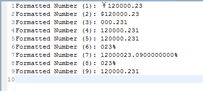

# 
f:number - 格式化数字
 #

&lt;f:number&gt;
<pre>
格式化数字。
</pre>

#### 说明 ####

<pre>
根据标签内填写的数字符串，输出格式化的数字,或者设置格式化的数字参数
</pre>

#### 属性 ####

<pre>
<b>var（可选）：存储格式化数字的变量。</b>
如果设置了var属性，只是设置了存储的变量，不会输出结果。
</pre>

<pre>
<b>setScope（可选）：设置变量的作用域。</b>
context:设置参数到context中(默认)
session:设置参数到session中
</pre>

<pre>
<b>pattern（可选）：格式化的样式。</b>
如: 12.34
"0.0"      ->   12.3      
"#.#"      ->   12.3
"000.000"  ->   012.340
"###.###"  ->   12.34 
具体用法参考java.text.DecimalFormat
</pre>

<pre>
<b>type（可选）：类型</b>
number:数值
currency:货币
percent:百分数
</pre>

<pre>
<b>groupingUsed（可选）：是否对数字分组</b>
true:是
false:否(默认值)
</pre>

<pre>
<b>currencyCode（可选）：货币码（当type="currency"时）</b>
</pre>

<pre>
<b>currencySymbol（可选）：货币符号 (当 type="currency"时)</b>
</pre>

<pre>
<b>parseLocale（可选）：解析数字时所用的区域</b>
所有地区编码，请参考java.util.Locale.getAvailableLocales()
如：
中国：zh_CN
美国：en_US
</pre>

<pre>
<b>integerOnly（可选）：是否只解析整型数</b>
true:是,整数型
false:否,浮点数(默认)
</pre>

<pre>
<b>maxIntegerDigits（可选）：整型数最大的位数</b>
</pre>

<pre>
<b>minIntegerDigits（可选）：整型数最小的位数</b>
</pre>

<pre>
<b>maxFractionDigits（可选）：小数点后最大的位数</b>
</pre>

<pre>
<b>minFractionDigits（可选）：小数点后最小的位数</b>
</pre>

#### 其它 ####

<pre>
如果设置了var属性，只是设置了存储的参数，不会输出结果。
</pre>

----------

#### 实例演示 ####

<pre>
例子1
</pre>

在action中设置number参数.

