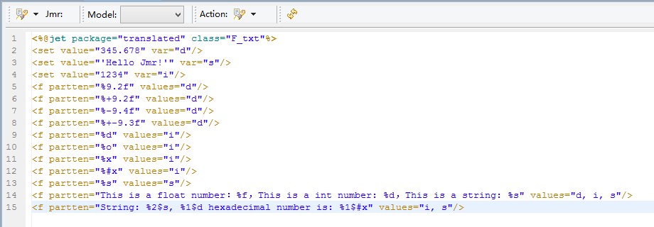
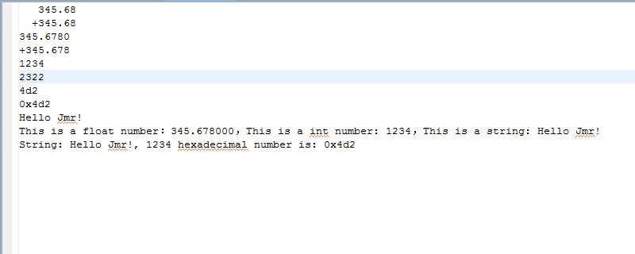
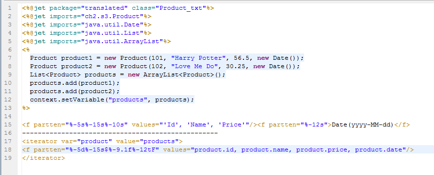
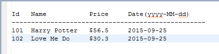

# 
f - Format
 #

&lt;f&gt;
<pre>
For formatting output
</pre>

#### Description ####

<pre>
Output the text in the label to the specified format.
</pre>

#### Property ####

<pre>
<b>partten（required）</b>
Format a string using the specified format string and arguments
Reference Java method String.format(String fmt, Object... args)
</pre>

<pre>
<b>values（optional）</b>
The specified parameters, multiple parameters can be filled, 
each with "," separated
</pre>

<pre>
<b>valueScope（optional）</b>
The scope of the variable

<b>property</b>
context:Get variable from context(default)
session:Get variable from session
</pre>

#### Other ####

<pre>
There are 2 formats for this label
1.&lt;f parrten="" values=""/&gt;

e.g.
&lt;f var="s" set value="'Hello Jmr!'"/&gt;
&lt;f partten="Demo: %s" values="s"/&gt;
-->Demo: Hello Jmr!

2.&lt;f parrten=""&gt;&lt;/f&gt;

e.g.
&lt;f var="s" set value="'Hello Jmr!'"/&gt;
&lt;f partten="Demo: %s"&gt;&lt;get value="s"/&gt;&lt;/f&gt;
-->Demo: Hello Jmr!
</pre>

----------

#### Examples ####

<pre>
<b>Please refer to the specific usage：String.format(String fmt, Object... args)</b>
String fmt     --&gt;   parrten = ""
Object... args --&gt;   values = ""
<b>Complete placeholder format： %[index$][flags]*[width][.precision]conversion</b>
</pre>

<pre>
Example 1
</pre>

<pre>
Example 2
</pre>

<pre>
Please open the generated file outside the eclipse, 
eclipse due to the font size problem, 
the display content may not be aligned.
</pre>

