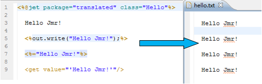

# 
get - Get Variable Values
 #

&lt;get&gt;
<pre>
Get variable values
</pre>

#### Description ####

<pre>
Get variables from the scope context or session,
Ognl expressions can be used to get the attributes and methods 
of variables, or custom ognl type variables
</pre>

#### Property ####

<pre>
<b>value（required）</b>
Get the variable value, variable relevant Ognl values are also obtained.
</pre>

<pre>
<b>valueScope（optional）</b>
Variable scope

<b>property</b>
context:Set variable to context(default)
session:Set variable to session
</pre>

<pre>
<b>case（optional）</b>
String case conversion, you can use the "" contains more than one 
operation, e.g. lower|plural

<b>property</b>
lr:String to lowercase (with lower)
ur:String to uppercase (with upper)
hlr:Head letters to lowercase (with headLower)
hur:Head letters to uppercase (with headUpper)
lower:String to lowercase
upper:String to uppercase
headLower:Head letters to lowercase
headUpper:Head letters to uppercase
plural:Plural form
singular:Singular form
</pre>

<pre>
<b>trim（optional）</b>
Whether to retain the output value of the front and back 
blank characters

<b>property</b>
false:To retain the output value of the front and back blank 
characters（default）
true:Delete the output value of the front and back spaces（Including 
the newline）
</pre>

#### Usage Detailed ####

##### &lt;get&gt;Output Rule #####

The following ways can be output "Hello Jmr!"，  
The four way is essentially converted into out.write (Object object)

Output value：
<pre>
Basic types：The output value is their own；
String：The output is string；
Object：Return value of output toString () method.
</pre>

<pre>
Using &lt;get&gt; get their value
</pre>

<pre>
Output results can be seen, List and array call the toString () method, 
array because there is no override toString () method, So the return 
is an address.
</pre>

<pre>
Tip: in the &lt;get&gt; value, place the mouse over it, or selected, 
you can indicate the value of this variable.
</pre>

##### &lt;get&gt;Source And Scope Of Value #####

Get variables from context and session, then how to set the variables 
to context and session? 

1.Set the variable in the context, the scope for the current task, the 
variable can only be shared in the current task of the template and action.
<pre>
Here in the template &lt;% %&gt; set the value of context, of course, 
can also be set context in the action, here set the String, boolean, 
int and List types of variables.
</pre>

<pre>
Using &lt;get&gt; get their value
</pre>

<pre>
Output result
</pre>

<pre>
Tips: in the &lt;get&gt; value according to the prompt key can 
indicate the value of the available variables.
</pre>

2.Set the variable in the session, the scope for the cross task, the 
variable can be shared in the multiple task of the template and action.
<pre>
Here in the template &lt;% %&gt; set the value of context, of course, 
can also be set session in the action, here set the String, boolean, 
int and Map types of variables.
</pre>

<pre>
Using &lt;get&gt; get their value, Scope valueScope input session
</pre>

<pre>
Output result
</pre>

<pre>
Tips: in the &lt;get&gt; value according to the prompt key can 
indicate the value of the available variables, the corresponding 
variables are based on the scope of action.
</pre>

3.Set the variable in the action
<pre>
In action can be set to context or session variables, where we 
set the context variable as an example. Here set the String, boolean, 
int and double[] types of variables.
</pre>

<pre>
Using &lt;get&gt; get their value
</pre>

<pre>
Output result
</pre>

<pre>
Tips: in the &lt;get&gt; value according to the prompt key can 
indicate the value of the available variables, here prompted to 
select the required action in the menu of the template.
</pre>

4.Set the variable in the &lt;set&gt;、&lt;for&gt; and other label.
<pre>
The variables set in set and for are essentially set in context or session.
</pre>

<pre>
Using &lt;get&gt; get their value, where for with the list tag cycle 
output, separator with ","
</pre>

<pre>
Output result
</pre>

##### &lt;get&gt; ognl Using Method #####

Get not only can get the variable value, but also can get the value 
of the Ognl attribute and method of the variable.

<pre>
The following is a Student class, which has 2 properties, id and name
</pre>

<pre>
New a Student object in the action
</pre>

<pre>
Point the action in the template to GetTagAction
</pre>

Can get the object's ognl values and ognl methods
<pre>
Ognl values:Object properties, if there is a corresponding getXXX() 
method, you can get it itself 
Student have id and name, because id and name have the corresponding 
getId and getName methods, so they can get the Ognl value.

Ognl methods:Object method 
Object that contains the method, if the method has a return 
value, you can get the return value.
</pre>

<pre>
Not only get the Ognl value of the object, but also can link to get 
its corresponding Ognl value.
e.g. Student.name for the String type, so you can also get the 
String corresponding to the name method.
</pre>

<pre>
Using &lt;get&gt; get their value.
</pre>

<pre>
Output result
</pre>

<pre>
Tips: in the &lt;get&gt; value, the mouse on the above, or selected, 
you can indicate the Ognl value of the variable.
</pre>

<pre>The mouse on the above</pre>

<pre>Select the required parts</pre>

