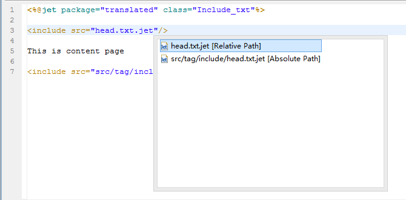

### 
include - 嵌套模板
 ###

&lt;include&gt;
<pre>
用于模板之间的嵌套调用
</pre>

#### 说明 ####

<pre>
为了方便模板的复用，可以在模板中调用其它模板的标签。
</pre>

#### 属性 ####

<pre>
<b>src（必须）</b>
嵌套的模板路径，可以是相对当前模板的路径，也可以是相对项目的根路径
</pre>

#### 其它 ####

<pre>
被嵌套的模板和当前模板，共享同一个context，它们有共同的变量作用域。
</pre>

----------

#### 实例演示 ####

<pre>
-当前模板-
可以在src中按提示键得到模板路径信息，可以是相对当前模板路径，也可以是相对项目根路径。
</pre>

<pre>
-头部嵌套模板-
</pre>

<pre>
-尾部嵌套模板-
</pre>

<pre>
-生成文件-
</pre>

