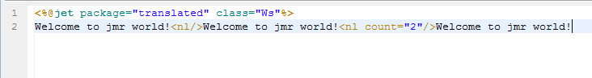
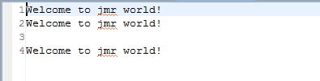

# 
nl - 换行
 #

&lt;nl&gt;
<pre>
在模板中输出换行符
</pre>

#### 说明 ####

<pre>
在模板中根据不同的操作系统，输出换行符，并可指定输出的换行符数量。
</pre>

#### 属性 ####

<pre>
<b>count（可选）</b>
指定输出的换行符数量，值必须为正整数
</pre>

#### 其它 ####

<pre>
在模板中输入"\n",并不能真正输出换行符和实现换行操作，
而只能输出字符"\n"本身的字符。所以需要用这个标签输出。
其功能也可由&lt;% out.wirte("\n"); %&gt;实现。

不同系统输出的换行符不一样：
Mac \r
Unix/Linux \n
Windows \n or \r\n
</pre>

----------

#### 实例演示 ####

<pre>
例子1
</pre>

