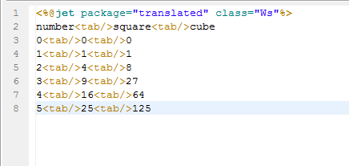
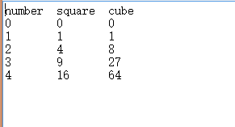

# 
tab - 制表
 #

&lt;tab&gt;
<pre>
在模板中输出制表符。
</pre>

#### 说明 ####

<pre>
在模板中输出制表符，并可指定输出的制表符数量。
</pre>

#### 属性 ####

<pre>
<b>count（可选）：指定输出的制表符数量，值必须为正整数。</b>
</pre>

#### 其它 ####

<pre>
在模板中输入"\t",并不能真正输出制表符和实现制表操作，
而只能输出字符"\t"本身的字符。所以需要用这个标签输出。
其功能也可由&lt;% out.wirte("\t"); %&gt;实现。
</pre>

----------

#### 实例演示 ####

<pre>
例子1
</pre>

<pre>
请在eclipse外部打开生成的文件，eclipse由于字体大小问题，显示内容可能不对齐。
</pre>
