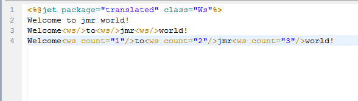
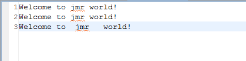

# 
ws - 空格
 #

&lt;ws&gt;
<pre>
在模板中输出空格
</pre>

#### 说明 ####

<pre>
在模板中输出空格，并可指定输出的空格数量。
</pre>

#### 属性 ####

<pre>
<b>count（可选）</b>
指定输出的空格数量，值必须为正整数
</pre>

#### 其它 ####

<pre>
其功能也可在模板中敲入空格，或者由&lt;% out.wirte(" "); %&gt;实现。
</pre>

----------

#### 实例演示 ####

<pre>
例子1
</pre>

