# 
任务配置
 #

----------

###目录:###

* [Hello Jmr!](#1)
* [创建Jmr文件](#2)
* [创建Jet模板](#3)
* [配置任务](#4)
* [运行任务](#5)
* [总结](#6)

----------

##Hello Jmr!##

Jmr全称Jet Model Robotization：基于Jet模板引擎的自动化工具。

<pre>
关于Jmr名称的意义：
<b>Jet</b>：是一款基于Eclipse的模板引擎，它是建模工具EMF的一部分，用于代码生成。
<b>Model</b>：模型的意思，Jmr是以模型驱动开发为理论体系的，模型是数据，代码生成的本质就是“数据+模板”。
<b>Robotization</b>：自动化，像机器一样；Jmr就像智能工厂中的机器人和流水线；
对于重复有规律的事物，Jmr就是流水线上自动化的机器人，善用它您将拥有一整套智能的流水线。
</pre>

呼唤莫若实干，我们开始第一个“Hello Jmr”代码生成任务
    
<pre>
这个任务的目的：
1.熟悉Jmr的界面和布局；
2.初步掌握模板的简单语法；
3.初步熟悉创建任务流程；
</pre>

----------

##创建Jmr文件##

1）在需要创建文件的位置，点击右键，或者在菜单->文件(file)；然后点击新(New)，选择Jmr。

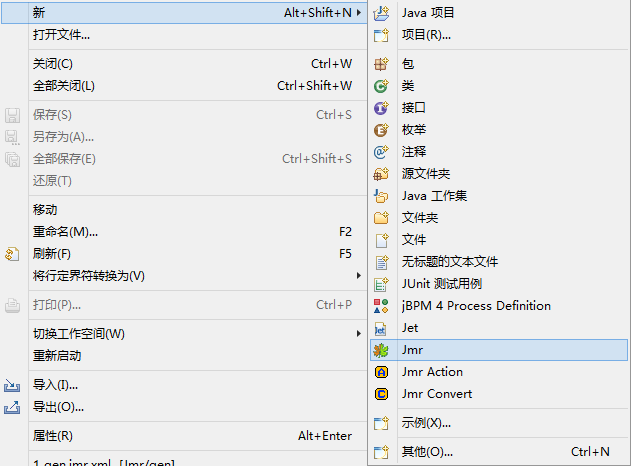

2）例子中，输入文件名gen。

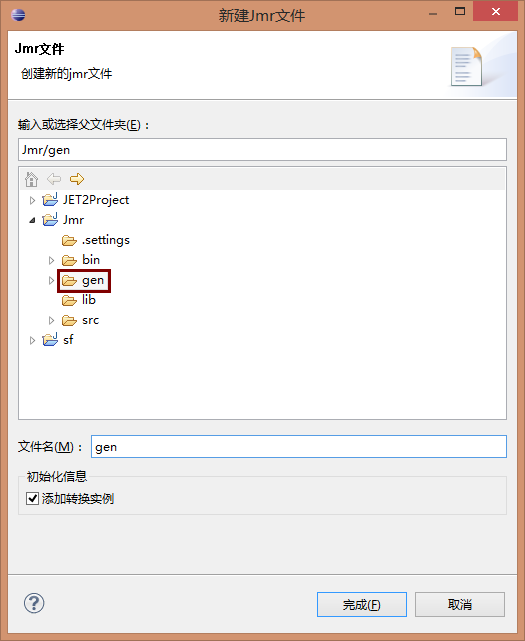

3）jmr文件创建成功

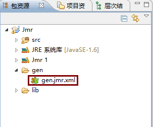

4）新建jmr文件后，打开文件，右键依次新建项目，新建目录

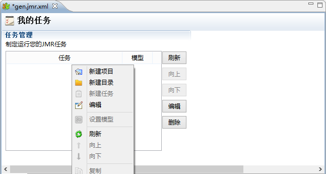

5）新建任务

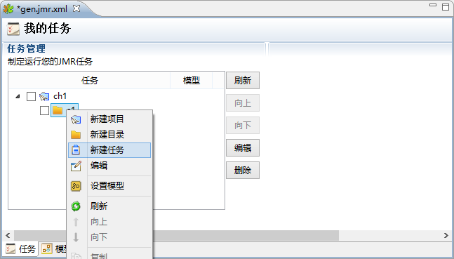

6）新建完成后的样子，这个任务因为是刚新建的，内容还没有填写完善，所以有个“错误”标识，接下来我们就要新建模板和设置生成文件来完善这个任务。

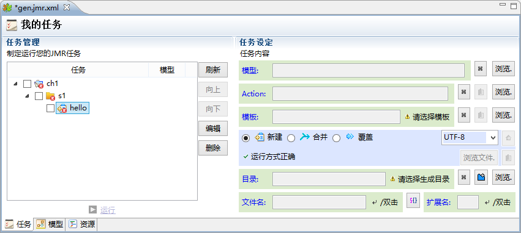

----------

##创建Jet模板##

1）在你需要创建模板的目录右键 新(New)，选择Jet

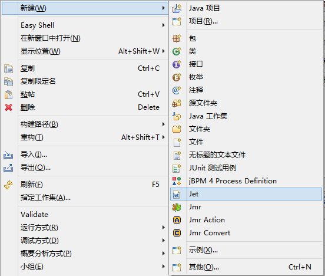

2）例子中，输入文件名hello。

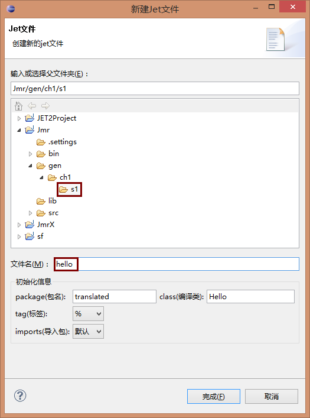

3）模板文件创建成功

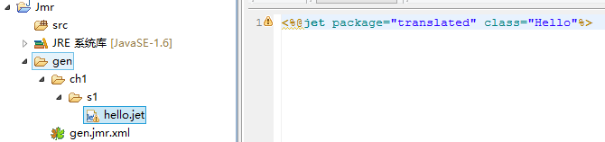

4）开始写入模板内容吧，在模板中写入以下内容：

>  Hello Jmr!
> 
> <%out.write("Hello Jmr!");%>
>  
> <%="Hello Jmr!"%>
>  
> <get value=&quot;'Hello Jmr!'"/>

这几种写法的结果都是生成"Hello Jmr!"字符串。

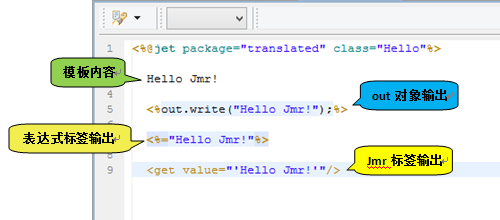

#####具体用法请参阅：#####
* <a href="out.html">out</a>
* <a href="script-script.html"><% %></a>
* <a href="script-expression.html"><%= %></a>
* <a href="tag-get.html">get标签</a>

----------

##配置任务##

有了模板后，我们现在可以开始配置任务了。

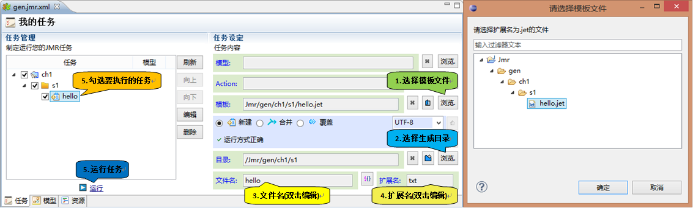

####执行以下步骤完成配置####

* 1.选择模板文件，选中hello.jet；
* 2.选择生成目录；
* 3.填写生成的文件名(hello)，双击或者回车可输入；
* 4.填写生成的文件扩展名(txt)，双击或者回车可输入；
* 5.勾中要执行的任务；
* 6.点击运行按钮；

----------

##运行任务##

点击运行后，在“运行”视图中，会显示运行任务的信息。

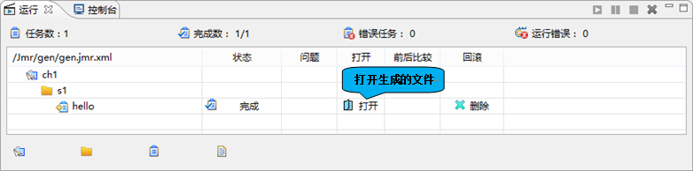

点击打开后，我们可以看到生成的文件。

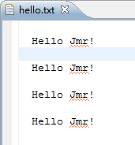

对比下模板和生成的内容。

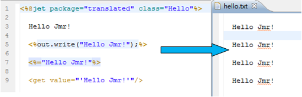

----------

##总结##

通过这个Hello Jmr!了解Jmr生成文件的过程，怎么样，是不是很容易。  
我们接下来就要深入了解Jmr了，有兴趣的小伙伴请跟上哦！Go,Go,Go！