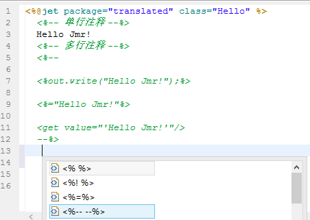
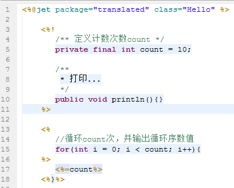

# 
注释
 #

----------

###目录:###

* [模板注释](#1)
* [java脚本注释](#2)

----------

##模板注释##

格式：<\!-- --> 

注释块中的内容会被屏蔽，不会被用于生成。可用于单行注释，也可以多行注释。

----------

##java脚本注释##

java脚本中的注释同java一样，这里不再赘述。

----------