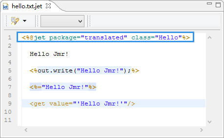
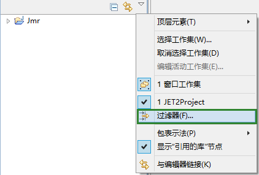
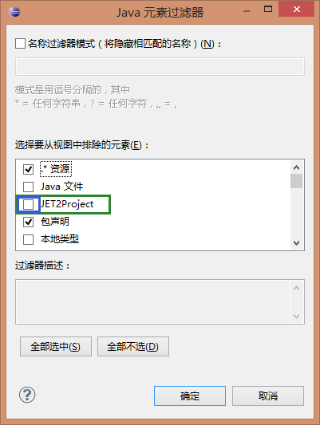
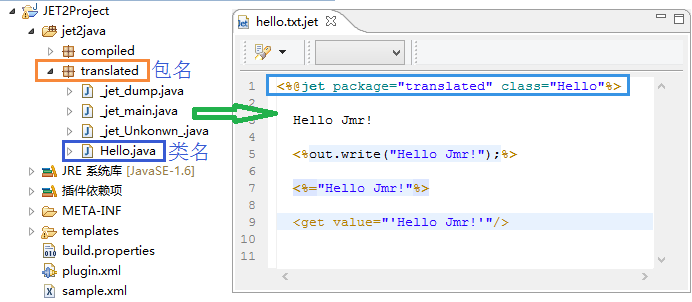
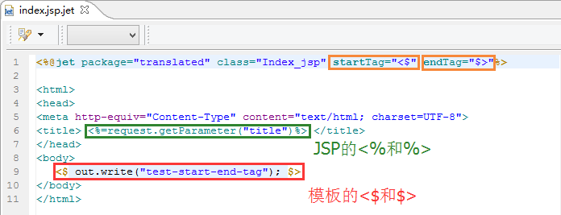
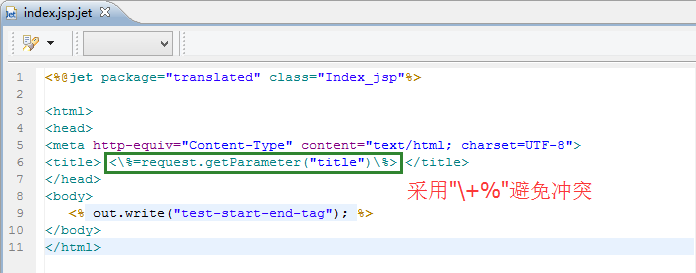

# 
编译声明
 #

----------

###目录:###

* [java编译类](#1)
* [编译声明的结构](#2)

----------

##java编译类##

每个模板都会被编译成java类，模板引擎读取这个java类生成代码或者文档
(<a href="template-preface.html#1">详细请点击</a>)。  
而编译声明是用来定义模板编译信息的。在模板的最顶部，每个模板都必须有且只有一个此声明。

其中package是编译后的java类的包名，class是类名。
那么，这个模板对应的java编译类在哪里呢？

1）点击过滤器

2）把JET2Project的勾选去掉，确定

3）可以看到一个隐藏的名为JET2Project显示出来了。
<!--  
模板中package="translated"，class="Hello"，正好对应起来。  
所以命名的时候，2个不同模板的package+class不能是一样的，  
否则可能会编译成同一个java类，执行生成的时候照成冲突，这也是命名规范中的一个要求(<a href="template-name.html#2">详细请点击</a>)。  
比如一个模板hello.txt.jet的package是"translated"，class为"Hello\_txt"。  
那么另一模板bye.txt.jet的package也是"translated"，class就不能再是"Hello\_txt"。
-->

----------

##编译声明的结构##

<%@jet .... %> ，用来定义编译信息的结构体，包含以下几个属性

* package(必填):编译的包名，新建时默认为translated，可以自定义为XX.XX.XX的包结构。
* class(必填):编译的类名，请按Java命名规范填写类名。
* startTag和endTag：脚本标签的开始和结束符号，默认startTag的值是"<%",endTag的值是"%>" 。  
  为什么会有这样的设定呢，因为如果生成的目标是jsp或者asp，其本身就会使用<%和%>，  
  这样就会和模板产生冲突。 那么我们就需要修改模板的<%和%>为其他符号。  
  注：startTag的格式必须是"<+特定符号"，endTag的格式必须是"特定符号+>"，  
  特定符号建议使用$、#、&，也就是写成<$ $> <# #> <& &>这样的格式。
  
  关于命名规范，<a href="template-name.html#2">详细请点击</a>。
  

此处我们把初始和结束标签修改为"<$"和"$>"，这样就不会造成冲突。

还有另外一种方式可以避免冲突，jsp或者asp自带的<% %>可以使用转移字符，在%前加上"\"；  
写成<!\% \%> <\% \%> <=\% \%>的格式。

  