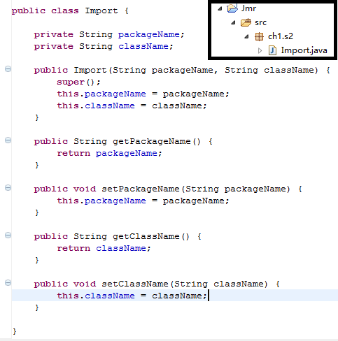
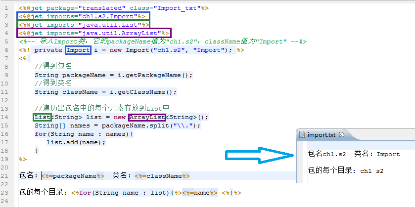
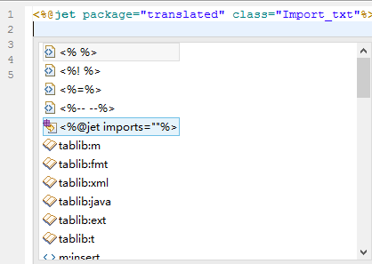
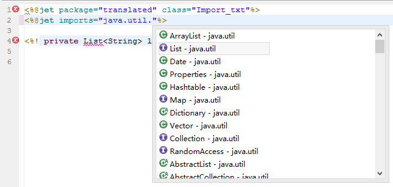
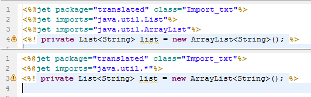
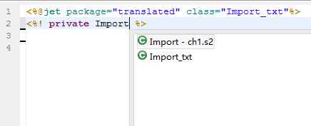
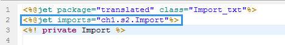

# 
导入声明
 #

----------

###目录:###

* [导入声明的需求](#1)
* [导入声明的结构和方法](#2)

----------

##导入声明的需求##

我们知道，模板中是可以嵌入java脚本标签的，类似于jsp的java脚本势必有import的概念。

能够写入java脚本的主要有3种类型的脚本标签：

* <a href="script-declare.html"><%! %> - 声明</a>
* <a href="script-script.html"><% %> - 脚本</a>
* <a href="script-expression.html"><%= %> - 表达式</a>

我们在项目中创建了一个Import类，它有2个属性packageName和className；

在以下模板中，我们创建一个Import对象，需要导入Import、List、ArrayList这3个类；  
功能是把Import对象的packageName、className以及packageName的每个子元素在模板中输出。  

----------

##导入声明的结构和方法##

从上面的模板可以看出，导入声明的格式为：<%@jet imports="XX.XX.XX" %>   
在项目构建路径里的依赖都可以被导入，不管是源文件夹、jar包或者其它依赖方式。

###模板编辑器提供了方便的导入帮助：###

* 提示导入结构，并可以在imports属性里搜索包或者类
   
<pre>1）使用提示快捷键（如alt+/），选择如下。</pre>

<pre>2）在imports里搜索包或者类。这边选择List</pre>
 

<pre>3）如果导入List后，还需要导入ArrayList，所以也可以直接写成java.util.*</pre>
 

* 提示自动导入

<pre>1）输入关键字，使用java提示快捷键（如alt+/），提示出相关信息，选择Import - ch1.s2。</pre>

<pre>2）编辑器会自动把导入声明插入。</pre>  
 

