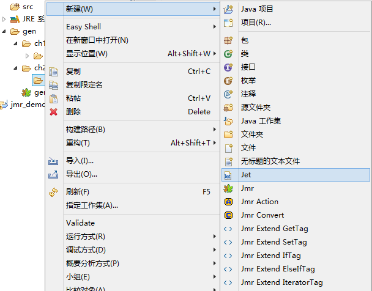
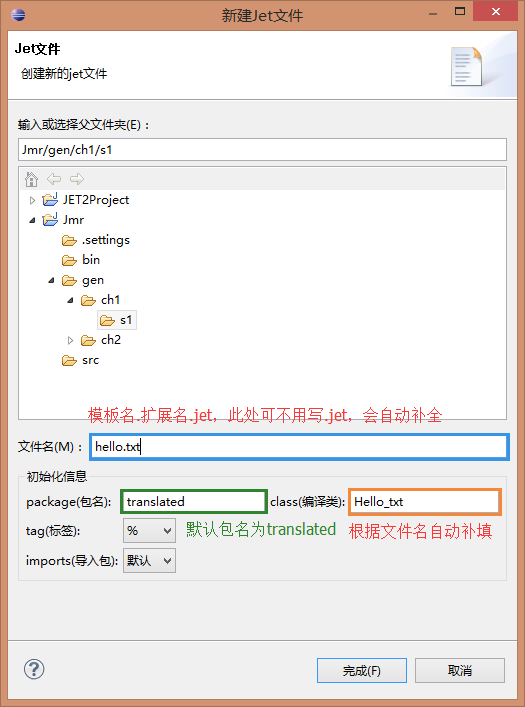
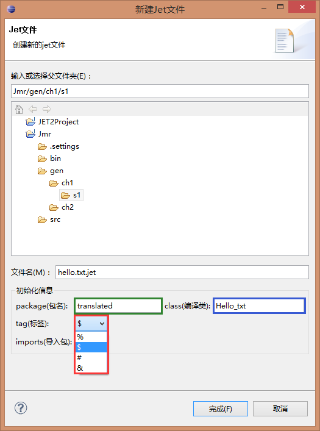
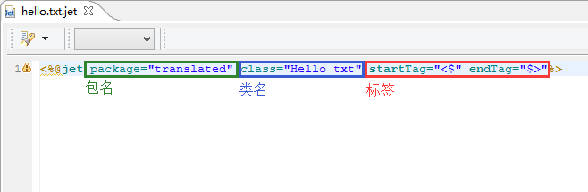
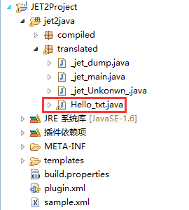
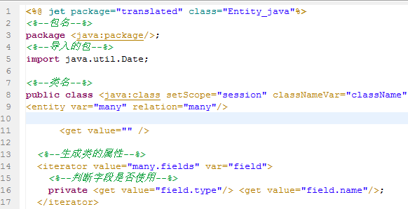
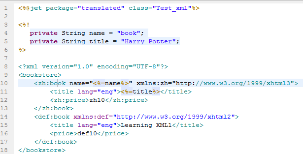
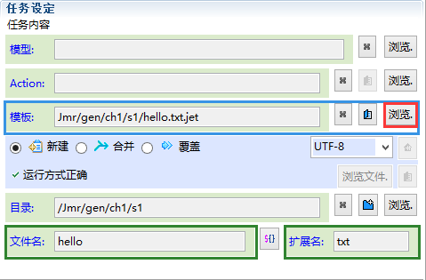

# 
模板命名规范
 #

----------

###目录:###

* [模板名规范](#1)
* [模板声明规范](#2)
* [命名规范的好处](#3)

----------

##模板名规范##

模板名格式：文件名.扩展名.jet，其中扩展名就是你需要生成文件的扩展名，比如为txt、java、jsp、html等。

第一个例子中的hello.jet就没有符合命名规范，正确的写法是要写成：hello.txt.jet。

新建模板的时候，请按命名规范来填写。

此处命名为hello.txt.jet。如果是生成java文件，就命名为*.java.jet，以此类推。

----------

##模板声明规范##

* 模板声明中的package：按照java包名规范:XX.XX.XX
* 模板声明中的class：按照java类名规范   
* 标签：当生成jsp或者asp时，其脚本标签也为<%和%>，会产生冲突，所以有必要更换标签(<a href="template-compile.html#2">详细请点击</a>)。
<!--
* package + class不能重复，因为模板会编译成对应的java类，  
  如果2个模板的package和class都是一样的，它们就会被编译成同一个java类，照成冲突(<a href="template-compile.html#1.1">详细请点击</a>)。  
  比如一个模板hello.txt.jet的package是"translated"，class为"Hello\_txt"。  
  那么另一模板bye.txt.jet的package也是"translated"，class就不能再是"Hello\_txt"。
-->

如下新建向导

生成的模板为

生成的java编译类为

----------

##命名规范的好处##

* 明确了生成文件的类型
* 模板语法着色会根据扩展名变化
  * java模板(如:entity.java.jet)
   
 
  * xml/html/jsp模板(如:book.xml.jet)
   
   

* 任务设置模板时自动填入文件名和扩展名
  
  

----------