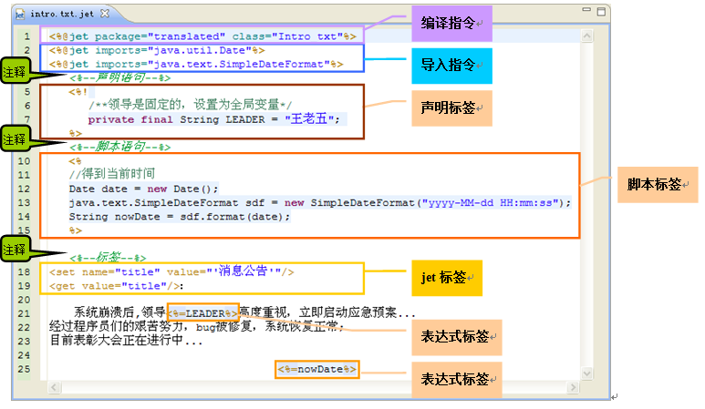

# 
概览
 #

----------

###目录:###

* [模板的原理](#1)
* [模板的结构](#2)

----------

##模板的原理##

模板文件的扩展名为jet，它会被编译成java模板类；模板引擎类似于机器臂，  
把建模注入后生成代码或者文档，整个过程类似于智能工厂的流水线；

----------

##模板的结构##

模板的结构如下(点击链接可进入对应的内容)

* 规范
   * <a href="template-name.html">模板命名</a>
* 指令
   * <a href="template-compile.html">编译声明</a>
   * <a href="template-import.html">导入声明</a>
   * <a href="template-comment.html">注释</a>
* 脚本标签
   * <a href="script-declare.html"><%! %> - 声明</a>
   * <a href="script-declare.html"><% %> - 脚本</a>
   * <a href="script-expression.html"><%= %> - 表达式</a>
* 内置对象
   * <a href="out.html">out - 打印</a>
   * context - 参数容器
     * <a href="template-var.html">var - 模板参数</a>
     * <a href="template-session-var.html">sessionVar - 全局参数</a>
* Jmr标签
   * 嵌套标签
     * <a href="tag-include.html">include - 嵌套模板</a>
   * 常规标签
     * <a href="tag-get.html">get - 获取参数</a>
     * <a href="tag-set.html">set - 设置参数</a>
     * <a href="tag-if.html">if - 判断</a>        
     * <a href="tag-elseif.html">elseif - 判断</a>
     * <a href="tag-else.html">else - 判断</a> 
     * <a href="tag-iterator.html">iterator - 循环迭代</a>
     * <a href="tag-delimiter.html">delimiter - 是否打印分割符</a> 
   * 排版标签
     * <a href="tag-ws.html">ws - 空格</a>
     * <a href="tag-nl.html">nl - 换行</a>
     * <a href="tag-tab.html">tab - 制表</a>
   * 格式化标签
     * <a href="tag-fmt-formatDate.html">fmt:formatDate - 格式化时间</a>
     * <a href="tag-fmt-parseDate.html">fmt:parseDate - 解析时间</a>
     * <a href="tag-fmt-formatNumber.html">fmt:formatNumber - 格式化数字</a>
     * <a href="tag-fmt-parseNumber.html">fmt:parseNumber - 解析数字</a>
   * 实体标签
     * <a href="tag-entity.html">entity - 实体对象</a>
     * <a href="tag-field.html">field - 字段</a> 
   * 合并标签
     * <a href="tag-m-insert.html">m:insert - 插入</a>
     * <a href="tag-m-update.html">m:update - 更新</a>  
   * xml标签
     * <a href="tag-xml.html">xml - xml对象</a>  
     * <a href="tag-xml-get.html">xml:get - 获取xml参数</a>
     * <a href="tag-xml-set.html">xml:set - 设置xml参数</a>      
     * <a href="tag-xml-if.html">xml:if - xml判断</a>
     * <a href="tag-xml-elseif.html">xml:elseif - xml判断</a>
     * <a href="tag-xml-else.html">xml:else - xml判断</a>
     * <a href="tag-xml-iterator.html">xml:iterator - xml循环迭代</a> 
   * java标签
     * <a href="tag-java-package.html">java:package - 得到包名</a>   
     * <a href="tag-java-class.html">java:class - 得到类名</a>        
   * 任务标签
     * <a href="task-modelGroupName.html">t:modelGroupName - 任务模型对应的组名</a>
     * <a href="task-tactionClass.html">t:actionClass - 任务Action</a>
     * <a href="task-templatePath.html">t:templatePath - 任务模板</a>
     * <a href="task-targetContainer.html">t:targetContainer - 任务目录</a>
     * <a href="task-targetName.html">t:targetName - 任务文件名</a>
     * <a href="task-targetExt.html">t:targetExt - 任务扩展名</a>
     * <a href="task-targetEncoding.html">t:targetEncoding - 任务文件编码</a>
     * <a href="task-generationMode.html">t:generationMode - 任务模式</a>  

----------

